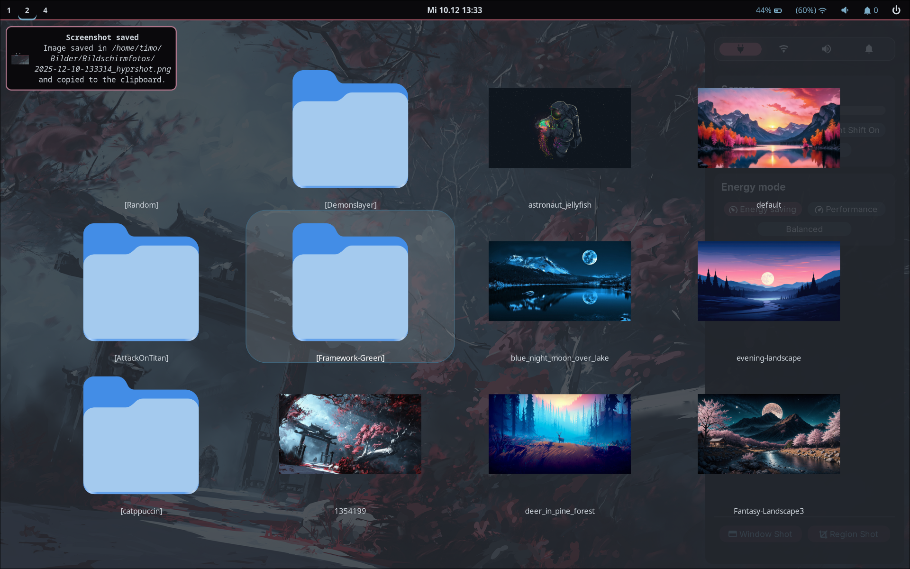

# Screenshots

   

   

### Chromium Pywal theme
adapted from https://github.com/metafates/ChromiumPywal
1. Open chromium
2. Go to chrome://extensions
3. Turn on "Developer Mode" in the top right corner
4. Press "Load unpacked"
5. Select "Pywal" (by default) in the same folder with the script

Each time you change your wallpaper you have to load the extension again.
